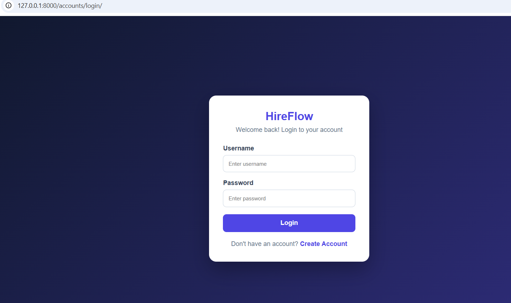
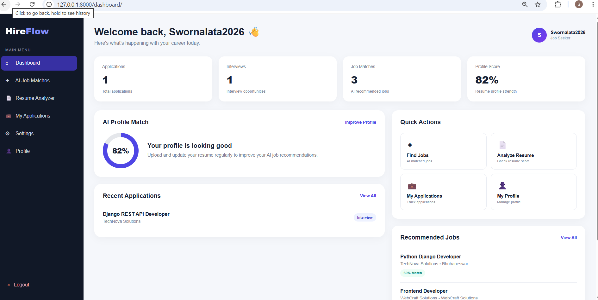
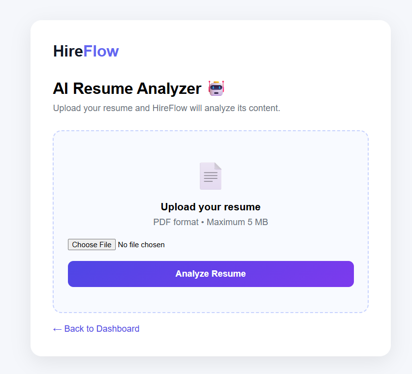
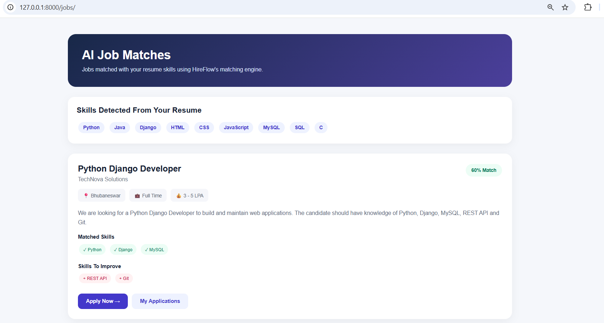
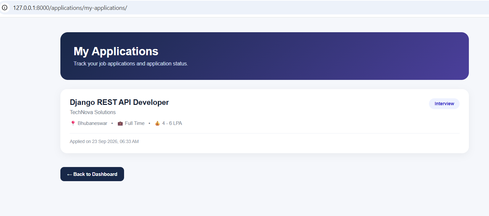
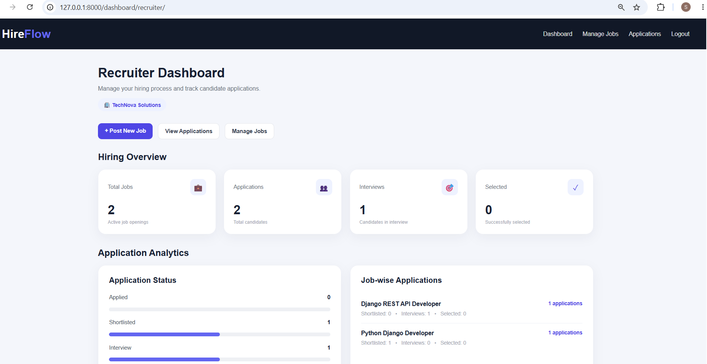

# HireFlow 🚀

HireFlow is a Django-based recruitment platform designed to connect job seekers and recruiters through a single web application.

It provides resume analysis, skill detection, job matching, job applications, application tracking, recruiter job management, candidate profiles, and REST APIs.

---

## ✨ Features

### 👤 Candidate Features

- User registration and login
- Candidate dashboard
- Candidate profile management
- Resume upload
- Resume text extraction
- Resume skill detection
- Resume profile analysis
- Job browsing
- Job matching
- Job application
- Application status tracking
- My Applications

### 🏢 Recruiter Features

- Recruiter registration
- Company profile
- Recruiter dashboard
- Post jobs
- Manage jobs
- Edit jobs
- Delete jobs
- View candidate applications
- Update application status

### 📄 Resume Analyzer

HireFlow allows candidates to upload resumes and process the extracted resume content.

The system detects technical skills from uploaded resumes, including:

- Python
- Java
- Django
- HTML
- CSS
- JavaScript
- MySQL
- SQL
- React
- Git
- GitHub
- REST API
- C++
- C
- Spring Boot
- MongoDB
- Node.js
- Express.js
- Bootstrap
- Docker

### 🎯 Job Matching

HireFlow compares detected resume skills with required job skills and calculates a matching result.

This helps candidates identify jobs that match their technical profile.

### 📋 Application Tracking

Candidates can:

- Apply for jobs
- View submitted applications
- Check application status

Recruiters can:

- View candidate applications
- Update application status

Supported application statuses include:

- Applied
- Shortlisted
- Interview
- Rejected
- Selected

---

## 📸 Screenshots

### 🔐 Login

### 👤 Candidate Dashboard

### 📄 Resume Analyzer

### 🎯 Job Matches

### 📋 My Applications

### 🏢 Recruiter Dashboard

---

## 🔌 REST API

HireFlow includes REST API endpoints for jobs, applications, and resume-related functionality.

### Job APIs

    /api/jobs/
    /api/jobs/<id>/
    /api/jobs/create/

### Application APIs

    /api/applications/
    /api/applications/apply/<job_id>/
    /api/applications/recruiter/
    /api/applications/recruiter/status/<id>/

### Resume APIs

    /api/resumes/

The APIs are built using Django REST Framework.

---

## 🛠️ Tech Stack

### Backend

- Python
- Django
- Django REST Framework

### Frontend

- HTML5
- CSS3
- JavaScript

### Database

- SQLite

### Development Tools

- Visual Studio Code
- Git
- GitHub
- Python Virtual Environment

---

## 📁 Project Structure

    HireFlow/
    │
    ├── accounts/
    │   ├── models.py
    │   ├── views.py
    │   ├── urls.py
    │   └── templates/
    │
    ├── applications/
    │   ├── models.py
    │   ├── views.py
    │   ├── api_views.py
    │   ├── api_serializers.py
    │   └── api_urls.py
    │
    ├── config/
    │   ├── settings.py
    │   ├── urls.py
    │   ├── asgi.py
    │   └── wsgi.py
    │
    ├── dashboard/
    │   ├── views.py
    │   ├── urls.py
    │   └── templates/
    │
    ├── jobs/
    │   ├── models.py
    │   ├── views.py
    │   ├── forms.py
    │   ├── api_views.py
    │   ├── api_serializers.py
    │   └── api_urls.py
    │
    ├── resume_analyzer/
    │   ├── models.py
    │   ├── views.py
    │   ├── api_views.py
    │   └── api_serializers.py
    │
    ├── screenshots/
    │   ├── login.png
    │   ├── dashboard.png
    │   ├── resume-analyzer.png
    │   ├── job-matches.png
    │   ├── applications.png
    │   └── recruiter-dashboard.png
    │
    ├── static/
    │   ├── css/
    │   └── js/
    │
    ├── templates/
    │
    ├── manage.py
    ├── requirements.txt
    ├── .gitignore
    └── README.md

---

## ⚙️ Installation

### 1. Clone the repository

    git clone https://github.com/YOUR_USERNAME/HireFlow.git

Replace `YOUR_USERNAME` with your GitHub username.

### 2. Open the project

    cd HireFlow

### 3. Create a virtual environment

For Windows:

    python -m venv venv

### 4. Activate the virtual environment

    venv\Scripts\activate

### 5. Install dependencies

    pip install -r requirements.txt

### 6. Apply migrations

    python manage.py migrate

### 7. Create an admin account

    python manage.py createsuperuser

### 8. Start the development server

    python manage.py runserver

Open the application:

    http://127.0.0.1:8000/

---

## 🔐 Security

The project excludes local development files and uploaded resume PDFs from Git using `.gitignore`.

The following files are not intended to be committed:

    venv/
    db.sqlite3
    resumes/*.pdf
    .env

For production deployment, sensitive configuration such as secret keys and database credentials should be stored using environment variables.

---

## 📱 Application Workflow

### Candidate Workflow

    Candidate
       │
       ├── Sign Up / Login
       │
       ├── Upload Resume
       │
       ├── Resume Analysis
       │
       ├── View Job Matches
       │
       ├── Apply for Job
       │
       └── Track Application

### Recruiter Workflow

    Recruiter
       │
       ├── Sign Up / Login
       │
       ├── Recruiter Dashboard
       │
       ├── Post Job
       │
       ├── Manage Jobs
       │
       ├── View Applications
       │
       └── Update Application Status

---

## 📊 Core Modules

### Accounts

Handles:

- User registration
- Login
- Logout
- Candidate profiles
- Recruiter profiles
- Profile settings

### Jobs

Handles:

- Job creation
- Job listing
- Job editing
- Job deletion
- Job matching
- Required skills

### Resume Analyzer

Handles:

- Resume upload
- Resume text extraction
- Skill detection
- Resume profile analysis

### Applications

Handles:

- Applying for jobs
- Candidate applications
- Recruiter applications
- Application status
- Application tracking

### Dashboard

Provides separate dashboard experiences for candidates and recruiters.

---

## 🔮 Future Enhancements

Possible future improvements include:

- AI-powered resume recommendations
- Advanced job recommendation system
- Email notifications
- Interview scheduling
- Candidate search and filtering
- Advanced recruiter analytics
- Production database integration
- Cloud deployment
- Automated resume ranking
- Authentication tokens for external API clients

---

## 👩‍💻 Author

**Swornalata Khuntia**

MCA Graduate | Python & Django Developer

---

## 📌 Project Status

HireFlow is an actively developed Django recruitment platform.

Built with Python, Django, Django REST Framework, HTML, CSS, JavaScript, and SQLite.